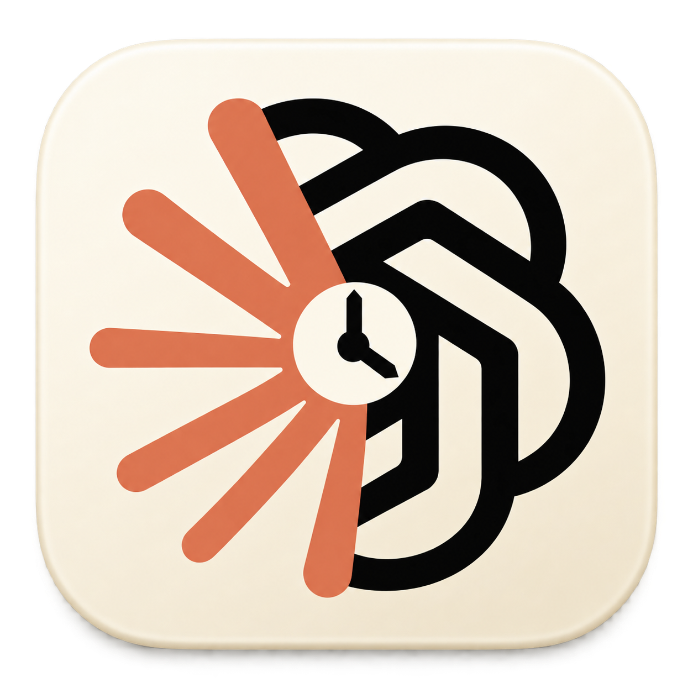
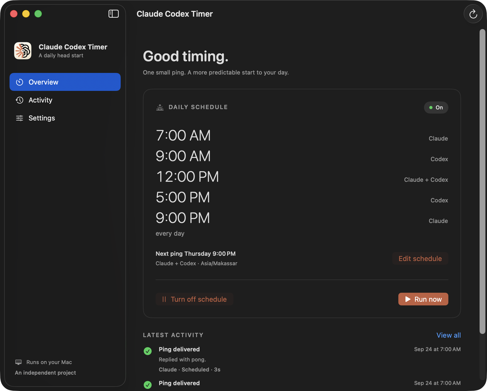
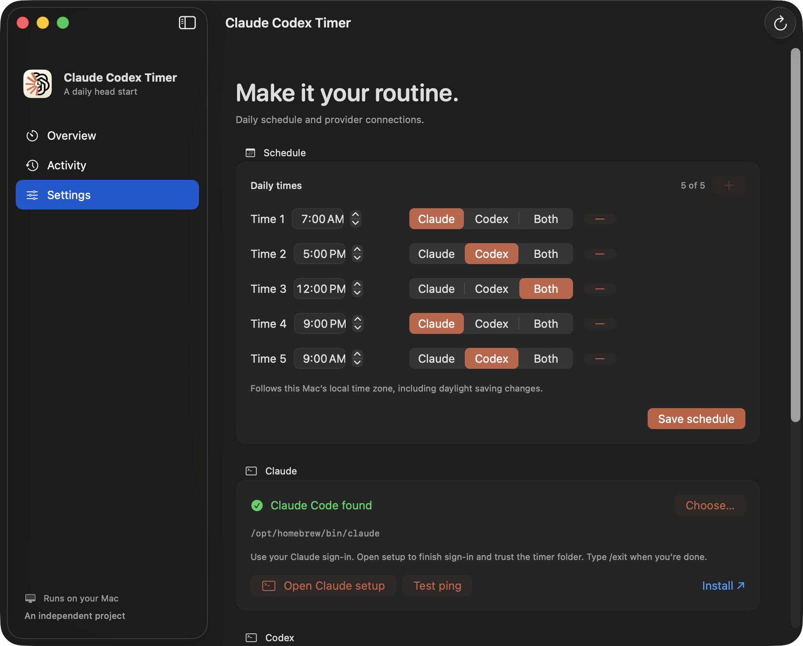
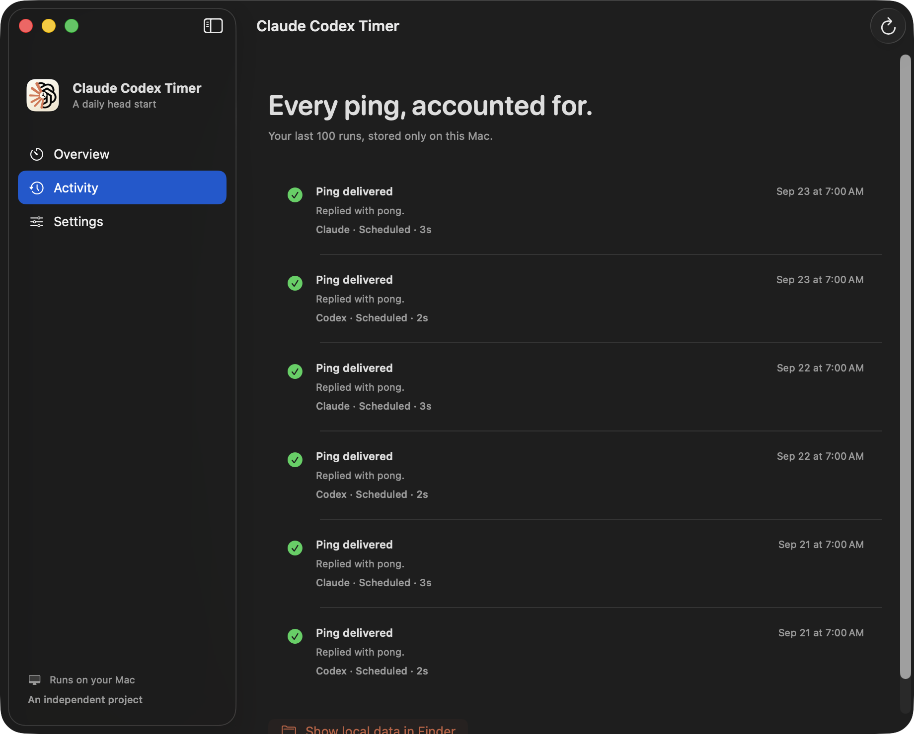

<p align="center">
  
</p>

<h1 align="center">Claude Codex Timer</h1>

<p align="center">Start your 5h usage limit window early, for Claude and Codex.<br>One small ping, at the time you choose. Built for Mac.</p>

<p align="center">
  <a href="https://github.com/juan23abc/claude-codex-timer/releases/latest/download/ClaudeCodexTimer.dmg"></a>
</p>

<p align="center">macOS 13+ · Apple silicon &amp; Intel · Free &amp; MIT licensed</p>



Choose **Claude, Codex, or both**, set up to five daily times, and let your Mac handle the routine. The schedule works even when the app is closed, and each provider gets its own result in **Activity**.

- **Your schedule.** Set one to five distinct local daily times, choose Claude, Codex, or both for each timer, pause the schedule, or run a ping on demand.
- **Your accounts.** Use your existing CLI sign-ins, with separate setup and tests for each provider.
- **Clear results.** Claude checks its usage window before and after each ping and records the reported reset time. See confirmed windows, unverified replies, setup issues, timeouts, and usage-limit failures.
- **Native and local.** SwiftUI window, menu bar controls, local history, and no analytics.

If it makes your mornings easier, [star the repository](https://github.com/juan23abc/claude-codex-timer) to support the project.

## Download and install

**[Download ClaudeCodexTimer.dmg](https://github.com/juan23abc/claude-codex-timer/releases/latest/download/ClaudeCodexTimer.dmg)** · [Release notes and checksums](https://github.com/juan23abc/claude-codex-timer/releases/latest)

1. Open the DMG and drag **Claude Codex Timer** into **Applications**.
2. Eject the disk image, then open the app from Applications.
3. In **Settings**, choose your providers, complete their CLI setup, and try **Test ping**.
4. Choose up to five daily times and enable the schedule.

**First launch:** this initial build is ad-hoc signed and is **not notarized by Apple**. If macOS blocks it and you trust this download, first try opening it, then use **System Settings → Privacy & Security → Open Anyway**. See [Apple’s instructions](https://support.apple.com/en-us/102445). You do not need to disable Gatekeeper.

**You still need [Claude Code](https://code.claude.com/docs/en/setup) and/or [Codex CLI](https://developers.openai.com/codex/cli) installed and signed in.** The DMG includes the timer and its helper, not either provider CLI. Pings use your account’s usage allowance.

## Screenshots

<details>
<summary><strong>Settings — choose daily times and providers for each timer</strong></summary>



</details>

<details>
<summary><strong>Activity — a separate result for every provider</strong></summary>



</details>

Screenshots show the native app with sample activity and example executable paths.

An independent project maintained by [juan23abc](https://github.com/juan23abc). Not affiliated with or endorsed by Anthropic or OpenAI.

## What it does

Each selected provider receives `Reply with exactly: pong`:

- **Claude:** reads the built-in `/usage` screen, opens a fresh interactive CLI session, waits for a completed `pong` reply, requests a clean exit, and reads `/usage` again. Green success requires a confirmed active five-hour window after the reply. Activity distinguishes a newly started window, an existing window, and an active window whose start could not be established. A reply with an unreadable or inactive usage window is an amber result and a nonzero runner exit. Older history is labeled “window unchecked.” Both usage readings are saved with their check times and reset times.
- **Codex:** uses the documented `codex exec --json` automation interface. Success requires a started thread, completed turn, an exact `pong` agent reply, and exit code zero. Error events and incomplete responses fail. Each call is ephemeral, so Codex does not retain its session rollout.

Pings run sequentially, with a separate history entry for each provider. Expired logins, usage limits, missing executables, setup prompts, unexpected replies, and timeouts are visible failures.

The original motivation was to start a usage window early in the day. **The app cannot force either provider to start or reset a window.** Claude’s before/after checks report the provider’s actual reset time instead of assuming that a reply starts a new window. Codex currently verifies delivery only. Pings consume account usage; API billing and subscription limits differ. The runner reuses saved CLI authentication and does not inherit API keys from the calling shell.

## Requirements

- macOS 13 Ventura or later.
- Current [Claude Code](https://code.claude.com/docs/en/setup) and/or [Codex CLI](https://developers.openai.com/codex/cli), with an active login for each selected provider. You only need the CLIs you select.
- Tested CLI versions: Claude Code **2.1.283**, Codex CLI **0.156.1**. Older releases may not support the required flags or usage display.
- To build: Xcode or Command Line Tools with Swift 5.9 or later. The app requires no third-party Swift packages, Python, Node, or Electron. Each provider CLI has its own installation requirements.

## Build and open

```bash
./scripts/build-app.sh
open "dist/Claude Codex Timer.app"
```

The app and bundle use **Claude Codex Timer**; the Swift package and app executable use `ClaudeCodexTimer`. Drag `Claude Codex Timer.app` to Applications to keep it there. Local builds are ad-hoc signed, not notarized for public distribution.

1. In **Settings**, choose **Claude**, **Codex**, or **Both** beside each timer.
2. Check the selected CLIs are found; **Choose…** supports custom installation paths.
3. For Claude, **Open Claude setup**, complete sign-in and explicitly trust the dedicated `~/.claude-timer` folder. Type `/exit` when finished. For Codex, **Sign in to Codex** opens the official login flow in Terminal; an existing CLI login is reused automatically.
4. Use the provider’s **Test ping** or **Run now** to verify replies. Run now pings each provider selected by any saved timer once.
5. Choose one to five daily times in **Settings**, use **+** to add a time or **-** to remove one, select the providers beside each time, and **Save schedule**. Enable the schedule from **Overview**. The default is **7:00 AM local time**; for example, use **7:00 AM** for Claude and **5:00 PM** for Codex.

Upgrading preserves settings and history, including an existing daily time and its provider selection. Old history entries are labeled Claude, and older settings remain Claude-only until you choose Both or Codex. The original script timer has an **Upgrade schedule** action that saves a backup and replaces its job only after the new jobs register successfully. Internal data paths and the first LaunchAgent identifier retain their original names for compatibility.

### Terminal shortcuts

```bash
./install.sh                 # build, install to ~/Applications, enable saved times
./install.sh 07:30           # same, selecting a time
./install.sh 07:00 17:00     # same, selecting two daily times (maximum five)
./ping.sh                   # ping all saved providers
./ping.sh --provider codex   # test only Codex
./uninstall.sh               # disable schedules; keep app, settings, and history
```

`send-hi.sh` remains an alias for older integrations. The helper supports:

```bash
"dist/Claude Codex Timer.app/Contents/Helpers/claude-codex-timer-runner" providers claude codex
"dist/Claude Codex Timer.app/Contents/Helpers/claude-codex-timer-runner" run --provider codex
"dist/Claude Codex Timer.app/Contents/Helpers/claude-codex-timer-runner" status
"dist/Claude Codex Timer.app/Contents/Helpers/claude-codex-timer-runner" enable 07:00
"dist/Claude Codex Timer.app/Contents/Helpers/claude-codex-timer-runner" enable 07:00 09:00 12:00 17:00 21:00
"dist/Claude Codex Timer.app/Contents/Helpers/claude-codex-timer-runner" disable
```

`run` prints a JSON array of provider results and exits nonzero if any selected provider fails. A single-provider test does not change the saved selections. The `providers` command sets the providers for every timer; individual selections are available in Settings. `enable` without times uses the saved timers. When replacing times, matching times retain their providers and new times use the combined saved provider selection.

## Scheduling and sleep

A per-user macOS LaunchAgent for each timer runs the compiled helper with that timer's providers, without `sudo`. The helper is copied outside Desktop/Documents so scheduling does not depend on the app’s location or access to the source folder. Enabling or editing the schedule does not immediately send a ping.

- You must be logged in; the app may be closed or quit.
- A calendar event missed during sleep runs after wake. Multiple missed occurrences of the same timer coalesce into one; separate timers keep their own provider selections. This does **not** wake the Mac; see `man launchd.plist`.
- Runs missed while shut down or logged out are not guaranteed to replay.
- Local time-zone and daylight-saving changes apply.
- macOS background-item controls can prevent jobs from running. Loaded status cannot guarantee a future launch or network connectivity.
- A process lock prevents overlapping batches. Scheduled timers wait their turn when launches overlap, including after wake. Each provider has a 90-second work budget, plus bounded subprocess cleanup; both together may take about three minutes. Claude’s budget includes the usage checks. The runner prevents idle sleep while a run is in progress, but does not wake a sleeping Mac. Provider failures are not retried.

## Privacy and local files

Claude Codex Timer has no analytics, direct network requests, or credential storage. Each CLI handles authentication and sends its prompt to its provider. A saved API-key CLI login can still incur API charges; excluding shell API-key variables does not change your saved login type.

Claude uses safe mode with built-in tools disabled, MCP tools denied, and hooks disabled through session settings. The app never edits `~/.claude.json` or answers trust prompts.

Codex uses a read-only sandbox with approvals disabled, ignores user configuration and execution rules for this invocation, skips project instructions, and disables shell execution, hooks, plugins, app integrations, multi-agent tools, and web search through session options. Saved authentication is still used. No sandbox or permission bypass is used. Organization-managed policy can still apply to either CLI.

| Location | Contents |
| --- | --- |
| `~/Library/Application Support/ClaudeTimer/` | Settings, last 100 provider results, lock, setup scripts, installed helper, Codex workspace, optional legacy backup |
| `~/Library/LaunchAgents/io.claude-timer.daily.plist` | First timer and its selected providers |
| `~/Library/LaunchAgents/io.claude-timer.daily.2.plist` through `.5.plist` | Additional timers and their selected providers |
| `~/Library/Logs/ClaudeTimer/runner.log` | Helper diagnostic output |
| `~/.claude-timer/` | Claude’s dedicated working folder |
| `~/.claude/projects/…` | Claude timer transcripts, managed by Claude Code |

Use **Show local data in Finder** to inspect app data. Redact account or usage details before sharing errors. Codex pings use ephemeral sessions, but the Codex CLI may maintain its own local diagnostics and authentication state. Removing the app alone does not remove its schedule: turn the schedule off first or run `./uninstall.sh`.

## Development

```bash
swift test
./scripts/build-app.sh
./scripts/build-app.sh --universal  # Apple silicon + Intel
./scripts/build-dmg.sh --layout    # universal DMG with a Finder install window
```

Tests use isolated temporary homes and fake CLI processes. They do not contact providers, change your real schedule, or read credentials. See [CONTRIBUTING.md](CONTRIBUTING.md), [review notes](docs/REVIEW.md), and [release preparation](docs/RELEASE.md).

Claude’s interactive transcript format is an implementation detail that can change. Codex’s automation protocol can also evolve. Unknown or incomplete output fails visibly. Provider references: [Claude CLI](https://code.claude.com/docs/en/cli-reference), [Claude usage guidance](https://support.claude.com/en/articles/9797557-usage-limit-best-practices), [Codex non-interactive mode](https://developers.openai.com/codex/noninteractive), [Codex configuration](https://developers.openai.com/codex/config-reference).

## Release status

The first DMG is being prepared for release; the download links above become available when it is published. See the [release checklist](docs/RELEASE.md) for remaining checks. Prebuilt apps are not yet Developer ID signed or notarized. No build or CI script publishes releases.

## License

[MIT License](LICENSE) · Copyright (c) 2026 juan23abc.

The license permits commercial use, modification, and redistribution, including closed-source derivatives, provided its copyright and license notice are preserved. The software is provided without warranty. Third-party names and logos belong to their respective owners; the software license does not grant rights to their trademarks. See the [artwork notes](Resources/Icon/README.md).
